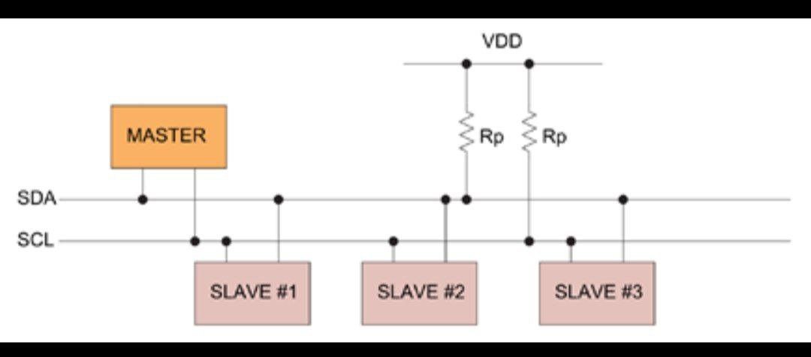
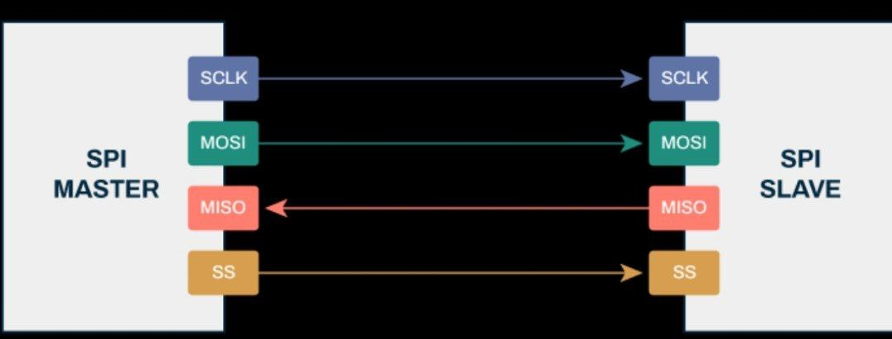
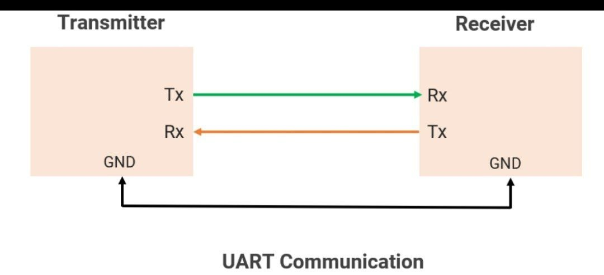

# Communication Protocols

This project demonstrates common communication protocols used in embedded systems.

Protocols implemented:

• SPI (Serial Peripheral Interface)  
• I2C (Inter-Integrated Circuit)  
• UART (Universal Asynchronous Receiver Transmitter)

These protocols are widely used in microcontrollers such as Arduino, ESP32, and STM32.

## Project Structure

I2C - Example code for I2C communication  
SPI - Example code for SPI communication  
UART - Example code for UART communication  

## Applications

Sensor communication  
Device interfacing  
Embedded system communication
## Communication Protocols

### SPI Protocol

### I2C Protocol

### UART Protocol

